# 迎新，开端

1. 介绍俱乐部活动安排、纪律规章
2. 讲解笔试易题：两种编程语言对比学习，从C++向Java过渡
3. 讨论笔试难题：两两一组，思考讨论，结对Java编程，最后讲解

## 笔试题目

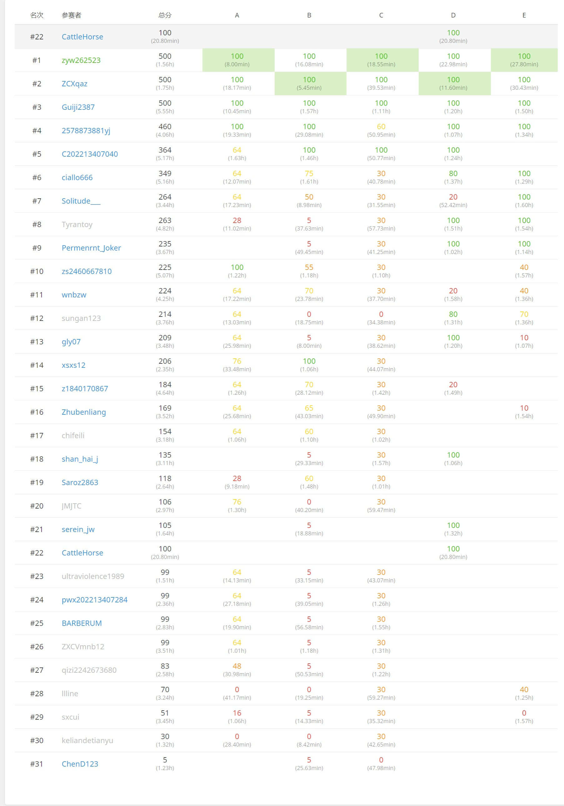

### A

28pt

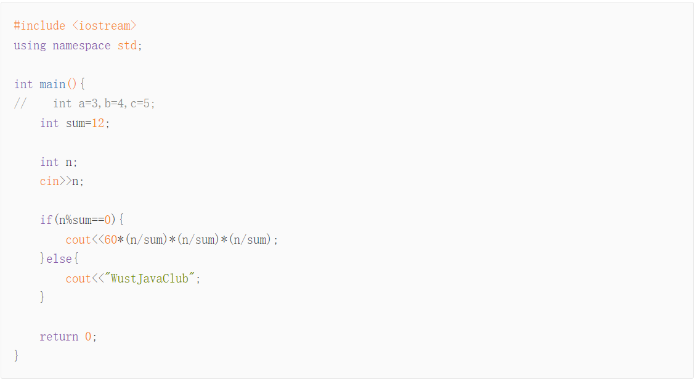

76pt

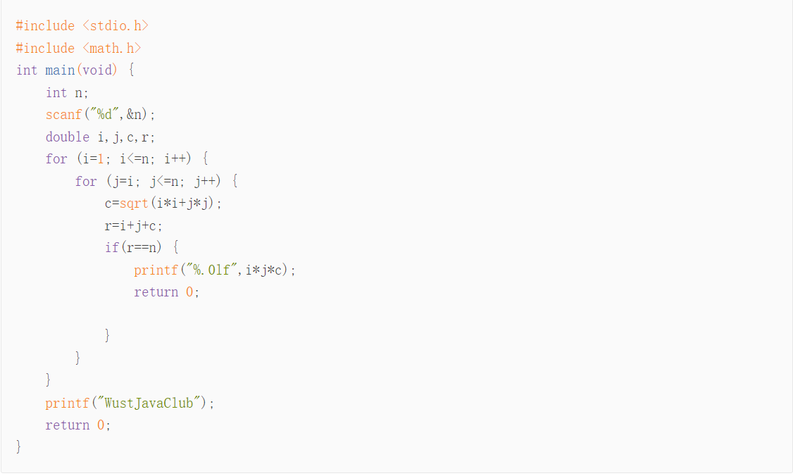

100pt

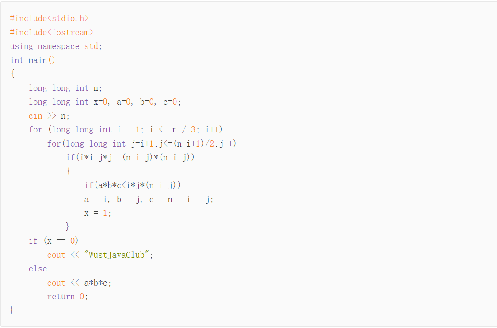

### B

5pt

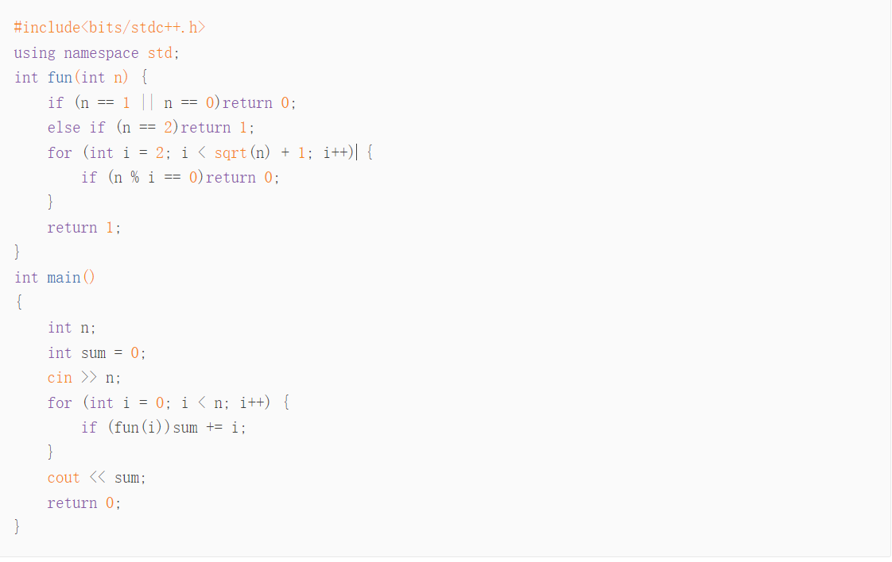

100pt

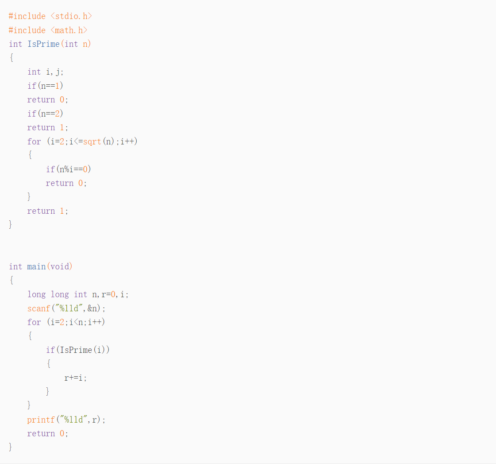

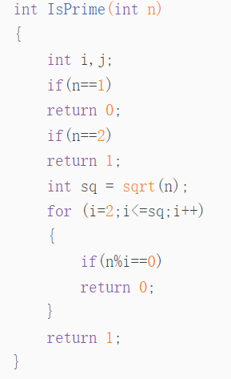

修改前


修改后


100pt

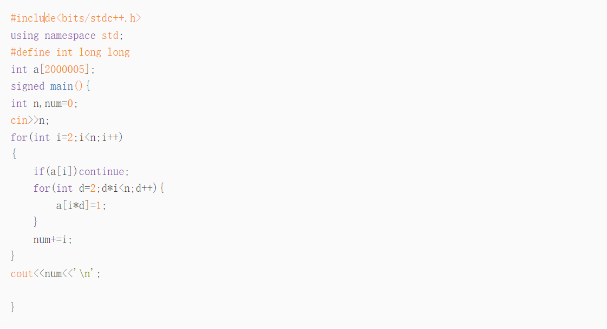

### C

30pt

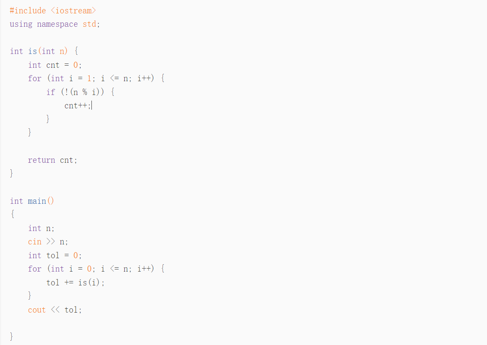

100pt

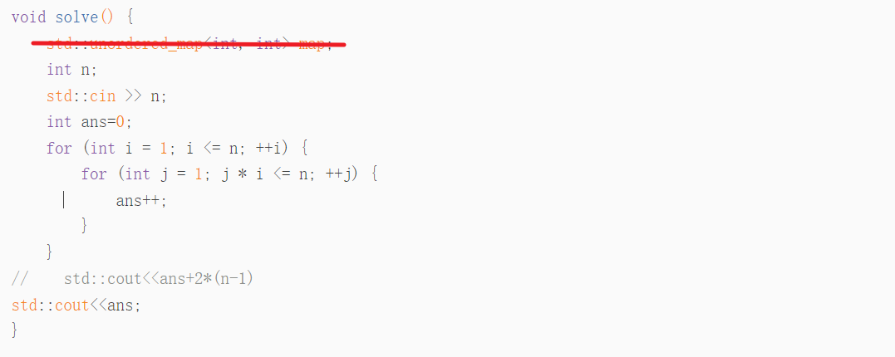

100pt

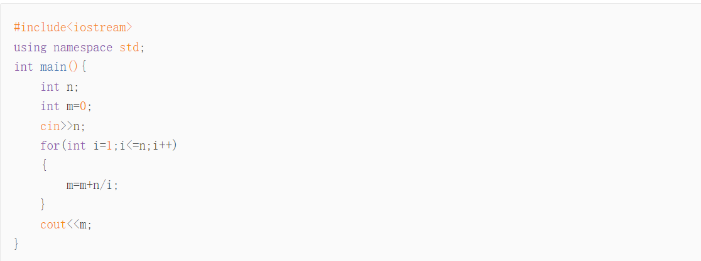

```
n = 6
1: 1
2: 1, 2
3: 1,  , 3
4: 1, 2,   4
5: 1,        5  
6: 1, 2, 3     6
1~n 以 i 作为约数，出现了多少次
i：i, 2i,3i, xi,   xi<=n 
1~n 以 i 作为约数，出现了 n/i 次(下取整)
```

### D

100pt

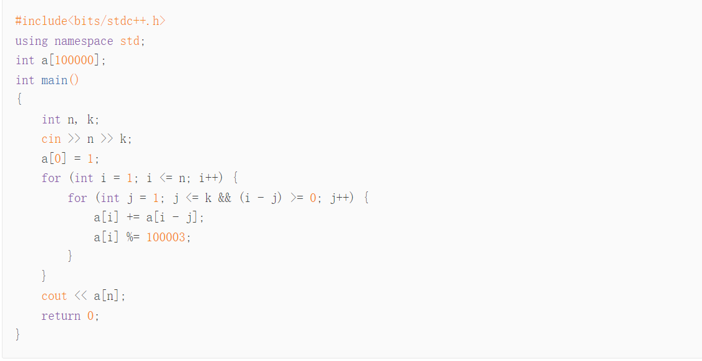

20pt

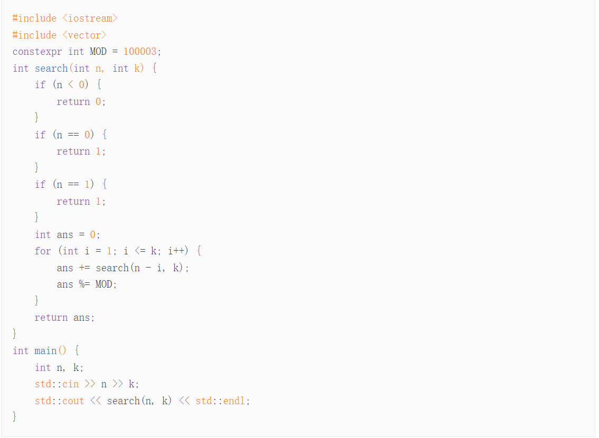

100pt


