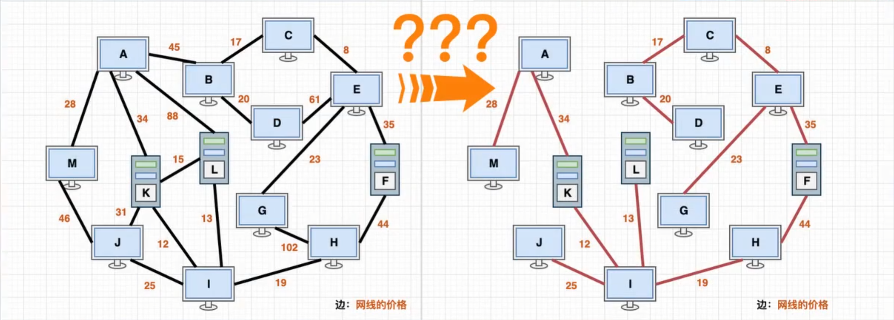

# 图论

## 基础

图是由节点和边构成的，树是一个特殊的图

边用来表示节点间的关系

无向图可以看作有向图（一条无向边变为两条有向边）


### 图的存储

#### 与树类似

采用多叉树形式的存储

```java
class Node {
 int id;
 List<Node> next;
}
Node[] nodes;
```

这样每一个节点都需要存储id这个属性

#### 邻接矩阵

利用数组的下标充当id属性，构建二维数组，两个维度分别表示两个节点id，二维数组的具体值表示两个节点间的关系（距离，方向等）

```java
// matrix[x][y]: `matrix[x][y]==true` means there is an edge with x pointing to y
bool[][] matrix;
```

#### 邻接表

邻接矩阵当x无指向y的边时，也进行了存储，可以通过动态增加x指向的节点表示有一条x指向y的边

```java
// adj[x][i]: there is an edge with x pointing to adj[x][i]
List<List<Integer>> adj;
```

#### 邻接表与邻接矩阵的优劣



邻接矩阵：在稀疏图的情况下浪费很多空间，但可以快速判断两个点间是否有边

邻接表：在稀疏图的情况下可以节省空间，需要遍历一个结点的所有出边才能判断两个点间是否有边

## 遍历

与树类似，有深度优先搜索（DFS）和广度优先搜索（BFS）形式的遍历

与树不同的是：

- 图是可能有环的（回路，走回自身）
- 图可能是不连通的，即分离的两个图

因此需要额外记录节点是否遍历过

### DFS

```
visited : boolean[]
graph : Graph
function dfs(start):
    if start is visited
        return
    visited[start] := true
    for i in graph.next(start):
        dfs(i)
  
# 图可能不连通，对每个点作为起点均遍历一次，如果某个节点已经在之前遍历时访问过了，则跳过
function traverse(): 
    for i in nodeIndex:
        dfs(i)
```

### BFS

```
visited : boolean[]
graph : Graph
function bfs(start) :
    if start is visited
        return
    visited[start] := true
    queue : Queue
    queue.add(start)
    while queue not empty:
        current := queue.poll()
        if current is visited
            continue
        for i in graph.next(current):
           queue.add(i)
 
# 图可能不连通，对每个点作为起点均遍历一次，如果某个节点已经在之前遍历时访问过了，则跳过
function traverse(): 
    for i in nodeIndex:
        bfs(i)
```

## 拓扑排序

假如需要学习一系列课程，有些课程可能需要先掌握另一些课程才能学习，制定合理的学习顺序，求解这类问题即是求解拓扑排序


拓扑排序：若将有向图中所有顶点排成一个线性序列，使得图中任意一条边上的两点由 u 到 v，u 点所在序列中的位置总是在 v 之前，则这个过程称为拓扑排序

显然的，拓扑排序的结果有多种，对于上图，其中一种拓扑排序如下：

```
Math CS HTML CSS English CLanguage JavaScript Frontend Java Backend Project
```

如果课程间存在循环依赖（即有环），则该图不存在拓扑序列（先有鸡还是先有蛋）

### Kahn 算法

> 出度：节点的出边条数
>
> 入度：节点的入边条数

如上图的 CS，其出度为 3，入度为 1

一个比较直接的想法是挨个学习没有依赖的课程（即入度为 0 的节点），在学习完这个课程之后，相当于所有依赖于这个课程的课不再依赖于这个课程（删去这个节点）。如果这个过程中，不存在入度为 0 的节点了，则说明无拓扑序列

```
graph : Graph
indegree : int[]
output : List
function kahn() :
    init -> indegree
    while exist indegree==0:
        node := findIndegreeEqualZero()
        output.add(node)
        indegree.remove(node)
        update indegree
    if output.size == graph.poiontCount :
        return output
    else :
        # There is no topological sequence
        exit
```

每个节点和边均访问了一次

时间复杂度：$O(V+E)$，其中，$V$ 为图中节点个数，$E$ 为图中边的个数

### 基于后序遍历的算法

根据拓扑序列的定义，对于每一个节点都应该先走其依赖的节点，这和树的后序遍历相似（先走子节点最后才走根节点），保证每个节点总在其后继节点访问之后访问，因此访问序列的倒序为拓扑序列

```
# status has three values, they are visited, visiting, unvisited
status : int[]
graph : Graph
output : List
function dfs(start) :
    if start is visiting :
        # cyclic exists, there is no topological sequence
        exit
    if start is visited :
        return
    status[start] := visiting
    for i in graph.next(start) :
        dfs(i)
    status[start] := visited
    output.add(start)

function topologicalSort() :
    init -> status
    for i in nodeIndex :
        dfs(i)
    reverse(output)
```

每个节点和边均访问了一次

时间复杂度：$O(V+E)$，其中，$V$ 为图中节点个数，$E$ 为图中边的个数

## 最小生成树

生成树：图中的包含所有节点的树

最小生成树：权重和最小的生成树

> 树的边数 = 节点数 - 1

当图中有相同权值的边时，可能会有多个最小生成树（有可能不选或都选了）



### Kruskal 算法

直接的选择边加入最终生成树中

把所有边的权重从小到大排列，只要不形成环（可以使用并查集判断环）就加入到最终的生成树中，直到：

- 所有边都判断完，该图不连通
- 已经加入了 `节点数-1` 条边，最小生成树已找到

```
function kruskal(edges) :
    MST := {}
    sort(edges)
    for edge in edges :
        if cycled :
            continue
        addMST(edge)
        if MST.size == graph.pointCount - 1 :
            return MST
    # The graph is not connected
    exit
```

时间复杂度：$O(E\log E)$，其中 $E$ 是图的边数

### Prim 算法

间接的选择边加入最终生成树中

将整个图分为已选择的点和未选择的点两部分，分别记为 MST, F，从连接两个部分的边中选出权值最小的边，将这个边的 F 中的节点加入至 MST 中

```
graph : Graph
function prim() :
    from := randomInt()
    rest := graph.v - {from}
    MST := {from}
    edges := {}
    while rest is non-empty :
        # Extend the newly added points
        edges := edges + {the edge with from to the point in rest}
        next := the node with the minimum dis from MST to rest in edges
        if next is null :
            # The graph is not connected
            exit
        move next to MST
        from := current
    return MST
```

时间复杂度取决于如何选择点

- 通过维护 $distance$ 数组选择，则时间复杂度为 $O(V^2 + E)$

  时间复杂度描述：所有边都会访问一遍，对于每个点都需要和其余点求最小的 $distance$

- 通过优先队列（二叉堆）维护边权，则时间复杂度为 $O((V+E)\log V)$

  时间复杂度描述：所有边都会访问一遍，只有新的边比原来的边更小时才会加入优先队列中，最坏情况下只有 $V$ 的元素在优先队列中，所有边都可能进入优先队列，只有 $V$ 个元素会出优先队列

## 最短路

### Dijkstra 单源最短路


图中 `0 -> 1 -> 7 -> 8 -> 2 -> 5 -> 4` 是一条从0到4的最短路径

和 Prim 算法类似

将整个图分为已选择的点和未选择的点两部分，分别记为 S, T，从连接两个部分的边中选出权值最小的边，将这个边的 T 中的节点加入至 S 中，并更新 **从 S 出发** 通过 **选中节点** 能到达的节点距离

> 人话：通过新加入的点，看能不能更快到达（他们说这叫松弛 Relax）

```
a  ---  b
  \     |
    \   |
      \ |
        c
通过b，更新a到c的距离
```

```
graph : Graph
function dijkstra(int start) :
    distance := A list of length n with infinite values
    distance[start] := 0
    rest := graph.v
    edges := {}
    while rest is non-empty :
        u := find minimum distance(from start) node in rest set
        rest := rest - {u}
        for v in graph.next(u) :
        if distance[v] > distance[u] + weight(u, v) :
            distance[v] = distance[u] + weight(u, v)
            # Here can record the precursor node to find the shortest path
    return distance
```

时间复杂度取决于如何选择点（和Prim算法相同）：

- 通过维护 $distance$ 数组选择，则时间复杂度为 $O(V^2 + E)$

  时间复杂度描述：所有边都会访问一遍，对于每个点都需要和其余点求最小的 $distance$

- 通过优先队列（二叉堆）维护边权，则时间复杂度为 $O((V+E)\log V)$

  时间复杂度描述：所有边都会访问一遍，只有新的边比原来的边更小时才会加入优先队列中，最坏情况下只有 $V$ 的元素在优先队列中，所有边都可能进入优先队列，只有 $V$ 个元素会出优先队列

### Floyd 全源最短路


> Floyd 判环和全源最短路无关，Floyd判环是个快慢指针的算法

1. 如果某个节点 $U$ 位于起点 $S$ 到终点 $T$ 的最短路径上，则 $S$ 到 $T$ 的最短路径等于从 $S$ 到 $U$ 的最短路径 加 $U$ 到 $T$ 的最短路径，即 $distance(S,T)=distance(S,U)+distance(U,T)$
2. 如果某个节点 $U$ 不位于起点 $S$ 到终点 $T$ 的最短路径上，则一定有 $distance(S,T)<distance(S,U)+distance(U,T)$

因此，在 $S$ 到 $T$ 之间逐个加点，判断这个点能不能使得 $S$ 到 $T$ 更短

> 判断图中任意两点的最短路径是否经过了某一点

```
graph : Graph
function floyd() :
    n := graph.pointCount
    distanc := An n times n matrix with a value of infinate
    for i in graph.nodeIndex :
        distance[i][i] := 0
    for edge(u, v) in graph.edges : 
        distance[u][v] := weight(u, v)
    for k from 1 to n : 
        for i from 1 to n :
            for j from 1 to n :
                if distance[i][j] > distance[i][k] + distance[k][j] :
                    distance[i][j] := distance[i][k] + distance[k][j]
                    # Here can record the precursor node to find the shortest path
    return distance
```

时间复杂度：$O(n^3)$

## 相关题目

- [1443. 收集树上所有苹果的最少时间](https://leetcode.cn/problems/minimum-time-to-collect-all-apples-in-a-tree/description/)
- [797. 所有可能的路径](https://leetcode.cn/problems/all-paths-from-source-to-target/)
- [207. 课程表](https://leetcode.cn/problems/course-schedule/)
- [210. 课程表 II](https://leetcode.cn/problems/course-schedule-ii/)
- [1584. 连接所有点的最小费用](https://leetcode.cn/problems/min-cost-to-connect-all-points/)
- [1334. 阈值距离内邻居最少的城市](https://leetcode.cn/problems/find-the-city-with-the-smallest-number-of-neighbors-at-a-threshold-distance/description/)
- [2049. 统计最高分的节点数目](https://leetcode.cn/problems/count-nodes-with-the-highest-score/description/)
- [851. 喧闹和富有](https://leetcode.cn/problems/loud-and-rich/description/)
- [954. 二倍数对数组](https://leetcode.cn/problems/array-of-doubled-pairs/)
- [2127. 参加会议的最多员工数](https://leetcode.cn/problems/maximum-employees-to-be-invited-to-a-meeting/description/)
- [778. 水位上升的泳池中游泳](https://leetcode.cn/problems/swim-in-rising-water/)
- [1631. 最小体力消耗路径](https://leetcode.cn/problems/path-with-minimum-effort/description/)
- [743. 网络延迟时间](https://leetcode.cn/problems/network-delay-time/description/)
- [2304. 网格中的最小路径代价](https://leetcode.cn/problems/minimum-path-cost-in-a-grid/description/)

本次作业在12月17日23:59之前发送至邮箱<cattle0horse@gmail.com>，标题命名格式固定为【JavaClub-HW8-Y2023-班级-姓名】，文件命名与标题命名相同，格式自定，可使用Word、Markdown、Latex排版

## 参考资料

[拓扑排序 - Bilibili](https://www.bilibili.com/video/BV1pV4y1K75T/)

[最小生成树 - Bilibili](https://www.bilibili.com/video/BV11p4y1D7BL/?p=8)

[图论最短距离(Shortest Path)算法动画演示 - Bilibili](https://www.bilibili.com/video/BV1q4411M7r9/)

[迪杰斯特拉算法代码可视化(Dijkstra) - Bilibili](https://www.bilibili.com/video/BV1JA4y1Q7PB/)

